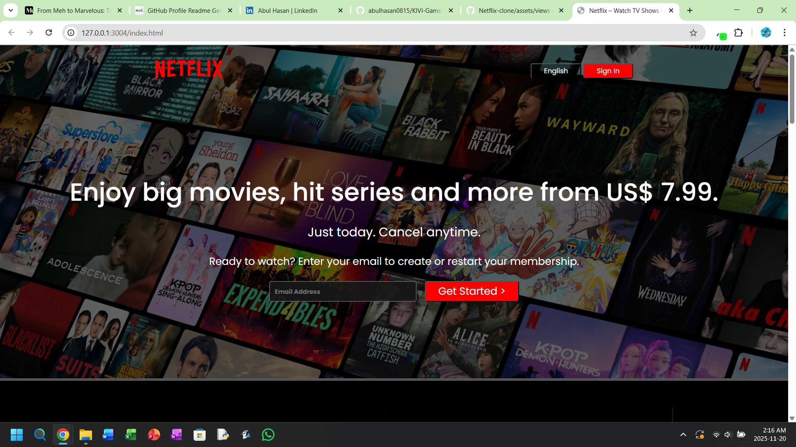
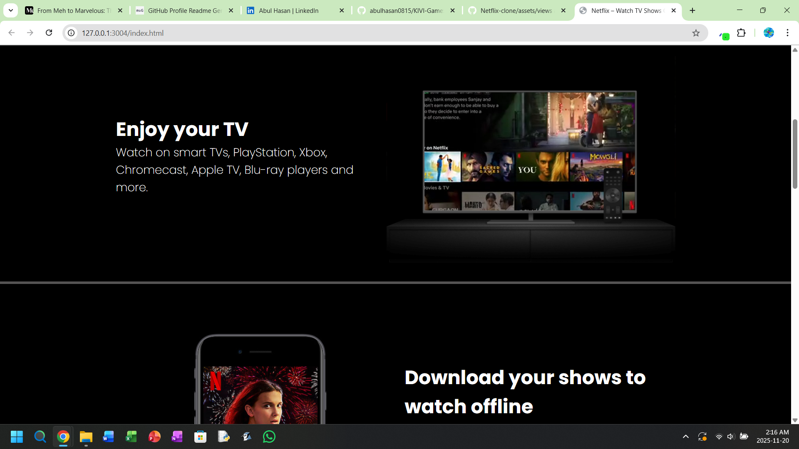
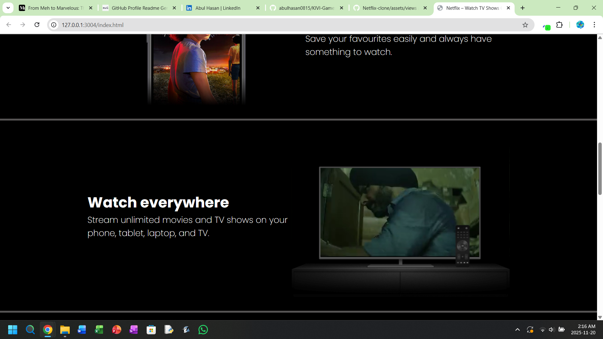
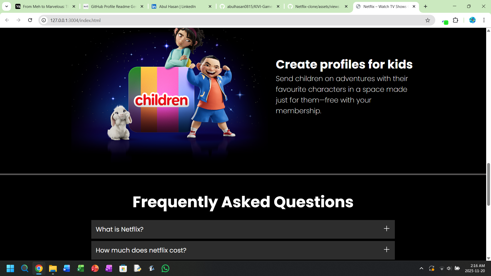

# Netflix-clone
**In my web dev learning curve I tried making a Netflix clone using just HTML and CSS incorporated mobile responsiveness. It's simple but made me learn a lot about how to use CSS to my advantage and best practices**

# 

# 

# 

# 

